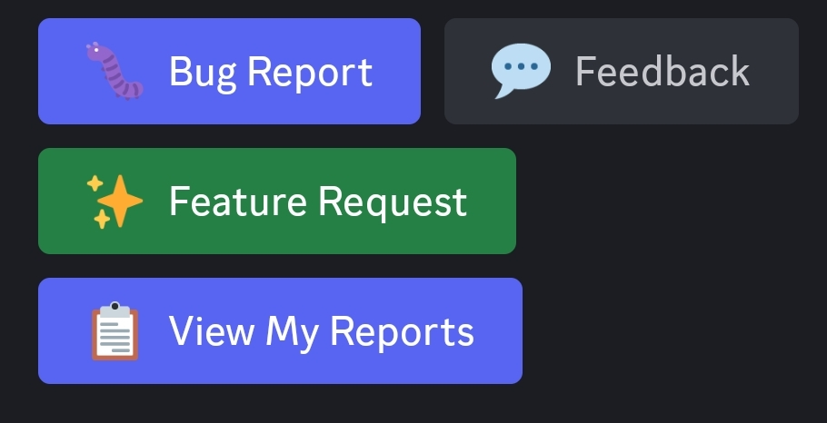

# Ticket System

## What is it?

The Discord ticket system is how almost every problem gets resolved. Your car meets Comma requirements but it's not supported yet on Star Pilot? Create a ticket. Are you getting ping ponging or steering wobble? Create a ticket. Or really for any reason beyond basic configuration related things. Firestar will get around to your ticket at his earliest convenience and push an update to remedy the issue. 

## Before creating a ticket!

You must first be a member in the [Discord Server](https://discord.com/invite/b8EzGp5RtE). 

When Firestar pushes a potential fix for the reason of your ticket, they get sent to the Dom branch, if you're on the StarPilot branch you will need to [swap branches](https://github.com/L4M3573R/StarPilotDocs/blob/main/docs/ticketsystem.md#wait-wait-wait-how-do-i-swap-from-starpilot-to-dom) to receive the update. 

## How do I create a ticket?

1. Open the StarPilot Discord.
2. Go to the [#submit-feedback-and-reports](https://discord.com/channels/1387432184121393333/1506463404863389806) channel.
3. Click on one of the buttons
   

   

      Bug Report
   

   Use the Bug Report button when somethings just not acting right. Like if a button on your steering wheel isn't working when it used to or other wonky things that seem off. 

   

      Feedback 
   

   Use this if you need your Comma to be tuned with your car, maybe the steering isn't enough, have some wobble in the steering wheel, generally stuff that isn't urgent. 

   

      Bug Report
   

   This is generally for more important matters or when things aren't acting as they should. These get handled first. 

   

      View My Reports
   

   This button will show you the list and status of all the reports you've made. 

4. Get your [route information and upload logs](./faq.md#how-do-i-upload-logs-for-troubleshooting)) and put the information into the form and click submit. When describing your feature or problem, it's best to be as descriptive as possible. 

> [!Tip]
> If you're able to reproduce the reason for your ticket, it's best to make 1 bookmark on your device before the issue occurs and 1 shortly after, include the bookmarks information in the ticket so it's easier for Firestar to hone in and fix it. 

## Wait wait wait, how do I swap from StarPilot to Dom?? 

It's super easy to change the branch you're on, this can be done 2 different ways(and you don't need to re-install like other forks force you to!).

Through the Comma:
1. Go to the device settings
2. Go to Software
3. Change the "target branch" option to Dom
4. Proceed on the screen
   
Through Galaxy:
1. Login to your Galaxy dashboard
2. Open the navigation bar
3. Go to Software
4. Find "branch switching" and change it to Dom
5. Then at the bottom of the page click the button that says "Switch + Update"

> [!Important]
> Your Comma must be in "offroad" mode to switch branches, this is done on your device.

> [!Tip]
> If you don't want to stay on Dom, wait for the next version of Star Pilot to be released and your fix will be in that version. Do the same process to switch back to the Starpilot branch. 

## What are each of the buttons for when submitting a ticket? 

